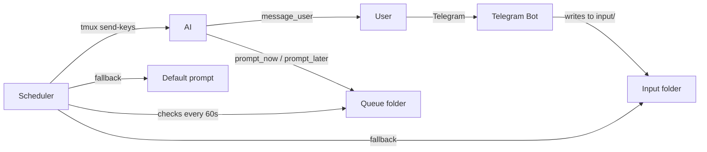

# selfcontrol-mcp

An MCP server that lets an AI prompt itself through tmux — enabling autonomous, continuous AI workflows with Telegram-based user communication.

## How it works

The AI runs in a tmux pane and has access to MCP tools: `prompt_now`, `prompt_later`, and `message_user`. The first two write timestamped prompt files to a queue folder. A background scheduler checks the queue every minute and delivers the next due prompt back to the AI via `tmux send-keys`.

If the AI hasn't scheduled anything, the scheduler falls back to manually placed prompts in an input folder, then to a configurable default prompt — ensuring the AI never sits idle.

The user communicates with the AI through a Telegram bot. Messages sent in Telegram are delivered as prompts to the active AI session. The AI communicates back via `message_user`, which sends Telegram messages directly.

A file-based generating lock prevents the scheduler from interrupting the AI mid-generation. A Claude Code `Stop` hook clears the lock when the AI finishes responding.



## Components

| File | Purpose |
|------|---------|
| `server.py` | FastMCP server — `prompt_now`, `prompt_later`, `message_user` tools + `start` prompt |
| `scheduler.py` | Background scheduler — delivers prompts via tmux |
| `telebot_runner.py` | Telegram bot — user ↔ AI communication |
| `reset_generating.py` | Hook script — clears the generating lock after AI finishes |
| `setup.py` | Interactive setup wizard — configures everything |
| `config.yaml` | Default prompt, intervals, paths, Telegram credentials (gitignored) |
| `example.config.yaml` | Template for `config.yaml` |

## Setup

```bash
python -m venv .venv
source .venv/bin/activate
pip install -r requirements.txt
python setup.py
```

The setup wizard will:
- Create `start.md` from the example template
- Configure `config.yaml` with sensible defaults
- Set up Telegram bot token and user ID
- Install the `Stop` hook in `~/.claude/settings.json`

Then add the MCP server to Claude Code:

```bash
claude mcp add selfcontrol python3 /path/to/selfcontrol-mcp/server.py
```

## Usage

1. Start a tmux session and open your project:
   ```bash
   tmux new -s work
   cd /your/project
   claude  # or any AI that supports MCP
   ```

2. In separate tmux panes, start the scheduler and Telegram bot:
   ```bash
   python /path/to/selfcontrol-mcp/scheduler.py
   python /path/to/selfcontrol-mcp/telebot_runner.py
   ```

3. In the AI, use the `/start` prompt to kick off the autonomous loop.

4. The AI schedules follow-up prompts for itself. The scheduler delivers them. The cycle continues.

5. Send messages via Telegram to give the AI tasks. The AI responds via Telegram using `message_user`.

## Telegram Bot

The bot is restricted to a single authorized user. Commands:

| Command | Description |
|---------|-------------|
| `/start` | Welcome message, shows active session |
| `/sessions` | Lists all sessions with clickable switch commands |
| `/s_ENCODED` | Switch active session (e.g. `/s_work_0_1` → `work:0.1`) |
| `/help` | Shows available commands |

Session names are encoded for Telegram compatibility: `work:0.1` becomes `/s_work_0_1`.

## Session isolation

Each tmux pane gets its own folder under `~/.ai-sessions/`:

```
~/.ai-sessions/work:0.1/
├── queue/            # Scheduled prompts (auto-deleted after delivery)
├── input/            # Manual fallback prompts (auto-deleted after delivery)
├── generating.lock   # Prevents interruption during generation
└── history.log       # Audit log of all delivered prompts
```

Multiple AI sessions can run in parallel without interference.

## License

GPL v3 — see [LICENSE](LICENSE).
