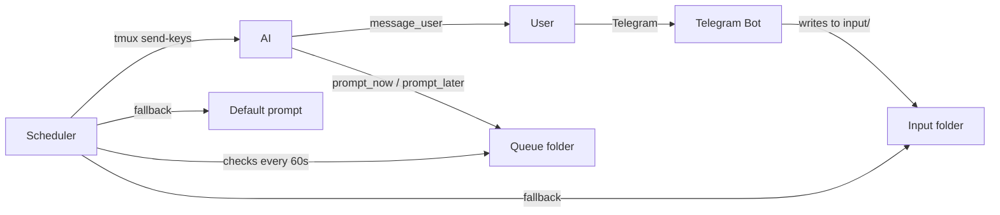

# selfcontrol-mcp

An MCP server that lets an AI prompt itself through tmux — enabling autonomous, continuous AI workflows with Telegram-based user communication.

## How it works

The AI runs in a tmux pane and has access to MCP tools: `prompt_now`, `prompt_later`, and `message_user`. The first two write timestamped prompt files to a queue folder. A background scheduler checks the queue every minute and delivers the next due prompt back to the AI via `tmux send-keys`.

If the AI hasn't scheduled anything, the scheduler falls back to manually placed prompts in an input folder, then to a configurable default prompt — ensuring the AI never sits idle.

The user communicates with the AI through a Telegram bot. Messages sent in Telegram are delivered as prompts to the active AI session. The AI communicates back via `message_user`, which sends Telegram messages directly.

A file-based generating lock prevents the scheduler from interrupting the AI mid-generation. A Claude Code `Stop` hook clears the lock when the AI finishes responding. A `Notification` hook alerts the user via Telegram when the AI needs attention. A `PermissionRequest` hook sends permission requests to Telegram with clickable allow/always/deny commands, enabling fully remote approval with a configurable timeout.



## Components

| File | Purpose |
|------|---------|
| `server.py` | FastMCP server — `prompt_now`, `prompt_later`, `message_user` tools + `start` prompt |
| `scheduler.py` | Background scheduler — delivers prompts via tmux |
| `telebot_runner.py` | Telegram bot — user ↔ AI communication |
| `reset_generating.py` | Hook script — clears the generating lock after AI finishes |
| `notify_user.py` | Hook script — notifies user via Telegram when AI needs attention |
| `permission_handler.py` | Hook script — remote permission approval via Telegram |
| `setup.py` | Interactive setup wizard — configures everything |
| `config.yaml` | Default prompt, intervals, paths, Telegram credentials (gitignored) |
| `example.config.yaml` | Template for `config.yaml` |

## Prerequisites

- **Python 3.10+**
- **tmux** — terminal multiplexer (the AI runs inside tmux panes)
- **Claude Code** — Anthropic's CLI (`claude`)
- **Telegram account** — for the communication bot

### Installing tmux

```bash
# Ubuntu/Debian
sudo apt install tmux

# macOS
brew install tmux

# Arch
sudo pacman -S tmux
```

### Installing Claude Code

Follow the official instructions at [claude.ai/code](https://claude.ai/code) or:

```bash
npm install -g @anthropic-ai/claude-code
```

## Setup

### 1. Clone and install dependencies

```bash
git clone https://github.com/YOUR_USER/selfcontrol-mcp.git
cd selfcontrol-mcp
python -m venv .venv
source .venv/bin/activate
pip install -r requirements.txt
```

### 2. Create a Telegram bot

1. Open Telegram and search for [@BotFather](https://t.me/BotFather)
2. Send `/newbot` and follow the instructions to create a new bot
3. Copy the **bot token** (looks like `123456:ABC-DEF...`)

### 3. Find your Telegram user ID

1. Open Telegram and search for [@userinfobot](https://t.me/userinfobot) or [@RawDataBot](https://t.me/RawDataBot)
2. Send `/start` to the bot
3. Copy your **user ID** (a number like `123456789`)

### 4. Run the setup wizard

```bash
python setup.py
```

The wizard will:
- Create `start.md` from the example template (your AI's startup instructions)
- Configure `config.yaml` with sensible defaults
- Ask for your Telegram bot token and user ID
- Install the `Stop`, `Notification`, and `PermissionRequest` hooks in `~/.claude/settings.json`

### 5. Register the MCP server with Claude Code

```bash
claude mcp add selfcontrol python3 /absolute/path/to/selfcontrol-mcp/server.py
```

### 6. (Optional) Set bot commands in Telegram

Send `/setcommands` to [@BotFather](https://t.me/BotFather) and paste:

```
start - Welcome message and active session
help - Show all available commands
current - Show current active session
sessions - List all sessions with switch commands
unlock - Remove generating lock for active session
```

## Usage

### Starting everything

tmux lets you run multiple processes in named windows within a single terminal. Here's how to set everything up:

```bash
# Create a new tmux session
tmux new -s work

# In the first pane: start the scheduler
python /path/to/selfcontrol-mcp/scheduler.py

# Split the pane (Ctrl+B, then %) and start the Telegram bot
python /path/to/selfcontrol-mcp/telebot_runner.py

# Create a new window (Ctrl+B, then C) for your AI session
cd /your/project
claude
```

**Quick tmux reference:**
| Key | Action |
|-----|--------|
| `Ctrl+B, %` | Split pane vertically |
| `Ctrl+B, "` | Split pane horizontally |
| `Ctrl+B, C` | Create new window |
| `Ctrl+B, N` | Next window |
| `Ctrl+B, P` | Previous window |
| `Ctrl+B, D` | Detach (session keeps running in background) |
| `tmux attach -t work` | Reattach to a detached session |

### Kickoff

Once Claude Code is running in a tmux pane, use the `/start` MCP prompt to bootstrap the autonomous loop. The AI will:

1. Save its instructions to a file (to survive context compaction)
2. Start working on tasks
3. Schedule follow-up prompts for itself
4. Communicate with you via Telegram

### Talking to the AI

Send messages in the Telegram bot chat. They are delivered as prompts to the active AI session. The AI responds via Telegram using `message_user`.

### Managing multiple sessions

You can run multiple AI sessions in different tmux panes. Each gets its own folder under `~/.ai-sessions/`. Use the Telegram bot to switch between them:

- `/sessions` — lists all sessions with clickable switch commands
- `/s_work_0_1` — switch to session `work:0.1`
- `/current` — show which session is active

### Slash command handling

The scheduler strips a leading `/` from prompts to prevent accidental Claude Code slash command triggers (e.g. if a Telegram command accidentally lands as input). To intentionally send a slash command to Claude Code, use `//` (e.g. `//init` becomes `/init`).

## Telegram Bot Commands

| Command | Description |
|---------|-------------|
| `/start` | Welcome message, shows active session |
| `/help` | Shows all available commands |
| `/current` | Shows current active session with switch command |
| `/sessions` | Lists all sessions with clickable switch commands |
| `/s_ENCODED` | Switch active session (e.g. `/s_work_0_1` → `work:0.1`) |
| `/unlock` | Remove generating lock for active session (unsticks the scheduler) |
| `/s_ENCODED_allow` | Allow a pending permission request (once) |
| `/s_ENCODED_always` | Always allow tool for this session |
| `/s_ENCODED_deny` | Deny a pending permission request |

The bot is restricted to a single authorized user via the `telegram_user_id` in `config.yaml`.

## Session isolation

Each tmux pane gets its own folder under `~/.ai-sessions/`:

```
~/.ai-sessions/work:0.1/
├── queue/            # Scheduled prompts (auto-deleted after delivery)
├── input/            # Manual fallback prompts (auto-deleted after delivery)
├── generating.lock   # Prevents interruption during generation
└── history.log       # Audit log of all delivered prompts
```

Multiple AI sessions can run in parallel without interference.

## Configuration

`config.yaml` (created by `setup.py`, gitignored):

```yaml
default_prompt: |
  No new user input. Continue working autonomously.
  ...
base_dir: ~/.ai-sessions
check_interval_seconds: 10              # How often the scheduler checks queue/input
default_prompt_interval_minutes: 5      # Min time between default prompts (minutes)
generating_timeout_minutes: 30          # Lock timeout (safety net if hook fails)
permission_timeout_minutes: 10          # Permission request timeout
permission_timeout_message: "Permission denied (timeout)."
telegram_bot_token: "your-token"
telegram_user_id: 123456789
```

See `example.config.yaml` for the template.

## License

GPL v3 — see [LICENSE](LICENSE).
