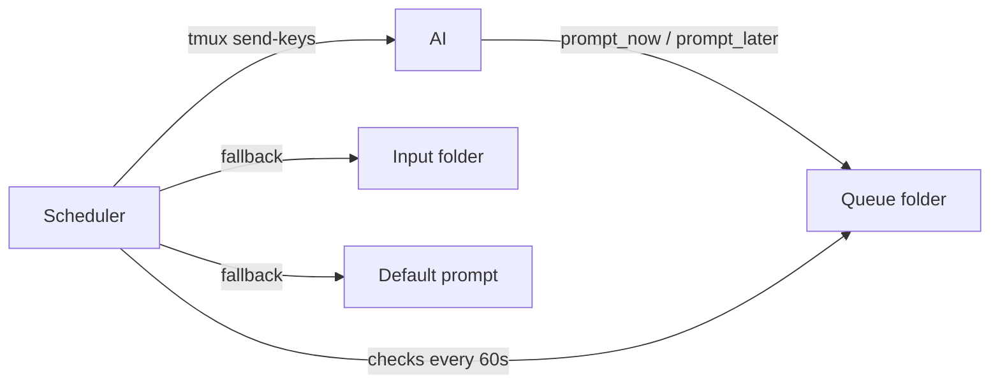

# selfcontrol-mcp

An MCP server that lets an AI prompt itself through tmux — enabling autonomous, continuous AI workflows.

## How it works

The AI runs in a tmux pane and has access to two MCP tools: `prompt_now` and `prompt_later`. These write timestamped prompt files to a queue folder. A background scheduler checks the queue every minute and delivers the next due prompt back to the AI via `tmux send-keys`.

If the AI hasn't scheduled anything, the scheduler falls back to manually placed prompts in an input folder, then to a configurable default prompt — ensuring the AI never sits idle.

A file-based generating lock prevents the scheduler from interrupting the AI mid-generation.



## Components

| File | Purpose |
|------|---------|
| `server.py` | FastMCP server — `prompt_now`, `prompt_later` tools + `start` prompt |
| `scheduler.py` | Background scheduler — delivers prompts via tmux |
| `reset_generating.py` | Hook script — clears the generating lock after AI finishes |
| `config.yaml` | Default prompt, intervals, paths |

## Setup

```bash
python -m venv .venv
source .venv/bin/activate
pip install -r requirements.txt
cp example.start.md start.md  # edit to customize your startup prompt
```

## Usage

1. Start a tmux session and open your project:
   ```bash
   tmux new -s work
   cd /your/project
   claude  # or any AI that supports MCP
   ```

2. In a separate tmux pane, start the scheduler:
   ```bash
   python /path/to/selfcontrol-mcp/scheduler.py
   ```

3. In the AI, use the `/start` prompt to kick off the autonomous loop.

4. The AI schedules follow-up prompts for itself. The scheduler delivers them. The cycle continues.

## Session isolation

Each tmux pane gets its own folder under `~/.ai-sessions/`:

```
~/.ai-sessions/work:0.1/
├── queue/            # Scheduled prompts (auto-deleted after delivery)
├── input/            # Manual fallback prompts (auto-deleted after delivery)
├── generating.lock   # Prevents interruption during generation
└── history.log       # Audit log of all delivered prompts
```

Multiple AI sessions can run in parallel without interference.

## License

GPL v3 — see [LICENSE](LICENSE).
