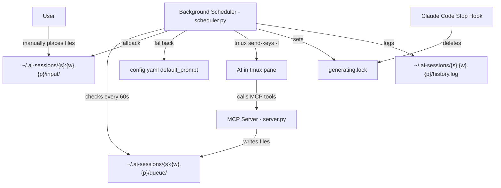

# Concept: selfcontrol-mcp

## Vision

An MCP server that gives an AI the ability to **prompt itself** through tmux. The AI can schedule prompts for immediate or future delivery, and a background scheduler ensures continuous activity by falling back to user-provided or default prompts when the queue is empty.

## How It Works



## Components

### 1. MCP Server (`server.py`)

Built with **FastMCP**. Runs inside the AI's process (e.g. as a Claude Code MCP server).

Tmux pane detection is **deferred** to the first tool call — not import time. This allows the server to start even outside tmux. If called outside tmux, tools return a friendly error message instead of crashing.

The server raises `FileNotFoundError` on startup if `start.md` does not exist.

#### Tools

| Tool | Description |
|------|-------------|
| `prompt_now(message)` | Queue a prompt for immediate delivery. Creates a file with a timestamp far in the past (1900-01-01) so it is always first in line. |
| `prompt_later(message, target_time?, delay?)` | Queue a prompt for future delivery. Accepts either an absolute `target_time` (ISO 8601) or a relative `delay` (e.g. `"10m"`, `"2h"`, `"1d"`). At least one must be provided; if both are given, `target_time` takes precedence. |

#### Prompts

| Prompt | Description |
|--------|-------------|
| `start` | Returns the contents of `start.md` from the repo root. This is a configurable startup prompt the user edits to bootstrap an AI session. |

### 2. Background Scheduler (`scheduler.py`)

A standalone Python script that runs in a **separate tmux window/pane**. One global instance manages all session folders.

#### Scheduler Loop (every 60 seconds)

For each session folder in `~/.ai-sessions/`:

1. **Check generating lock** — If `generating.lock` exists and is less than 30 minutes old, skip this session (the AI is still working).
2. **Check queue** — Look for prompt files with a target time in the past. Pick the **oldest** one.
3. **Fallback to input** — If no queued prompts are due, check the `input/` folder. Pick the **oldest** file.
4. **Fallback to default** — If the input folder is also empty, use the `default_prompt` from `config.yaml`.
5. **Send** — Deliver the prompt via `tmux send-keys -l` (literal mode, no interpretation) followed by a separate `Enter` key.
6. **Set generating lock** — Write `generating.lock` with the current timestamp.
7. **Log** — Append an entry to `history.log` (timestamp, source, prompt summary).
8. **Clean up** — Delete the consumed prompt file (from queue or input).

### 3. Hook Script (`reset_generating.py`)

A small Python script called by a **Claude Code `Stop` hook**. It:

1. Determines the current tmux session/window/pane (via `tmux display-message -p`).
2. Deletes the corresponding `generating.lock` file in `~/.ai-sessions/{s}:{w}.{p}/`.

If not running inside tmux (e.g. tmux not installed, or no active session), the script **silently exits** without error.

The hook can be installed automatically by `setup.py`, or manually added to `~/.claude/settings.json`.

### 4. Setup Wizard (`setup.py`)

An interactive setup script using **questionary** that:

1. Creates `start.md` from `example.start.md` (optionally opens in `$EDITOR`)
2. Configures `config.yaml` — prompts for each value with sensible defaults
3. Installs the `Stop` hook in `~/.claude/settings.json` (detects existing hooks, avoids duplicates)

## Session Detection & Folder Structure

The MCP server auto-detects its tmux pane by running:

```bash
tmux display-message -p '#{session_name}:#{window_index}.#{pane_index}'
```

This produces an identifier like `0:1.2` (session `0`, window `1`, pane `2`).

Each pane gets its own folder:

```
~/.ai-sessions/
├── 0:1.2/
│   ├── queue/
│   ├── input/
│   ├── generating.lock
│   └── history.log
├── main:0.0/
│   ├── queue/
│   ├── input/
│   ├── generating.lock
│   └── history.log
└── ...
```

## Prompt File Format

Queue files are named with their target delivery time for easy sorting:

```
queue/20260320T153000_a1b2c3.txt
```

- `20260320T153000` — Target time in compact ISO 8601 (local time)
- `a1b2c3` — Short random suffix to avoid collisions
- File content: the raw prompt text

For `prompt_now`, the filename uses `19000101T000000` to ensure it sorts first.

Input files can have any name — they are sorted by filesystem modification time (oldest first).

## Configuration (`config.yaml`)

```yaml
default_prompt: "Continue working on the current task. If no task is active, review recent changes and suggest improvements."
base_dir: "~/.ai-sessions"
check_interval_seconds: 60
generating_timeout_minutes: 30
```

## Generating Lock — Preventing Interruption

The generating lock prevents the scheduler from sending a new prompt while the AI is still working on the previous one.

**Set by:** The scheduler, immediately after sending a prompt via tmux.

**Cleared by:** The hook script (`reset_generating.py`), called by a Claude Code `Stop` hook when generation completes.

**Timeout:** If the lock file is older than `generating_timeout_minutes` (default 30), the scheduler ignores it and sends anyway. This prevents a stale lock from permanently blocking a session.

## Typical Usage Flow

1. Run `python setup.py` to configure everything
2. Create a tmux session: `tmux new -s work`
3. In pane 0: `cd /my/project && claude` (start Claude Code)
4. Split pane or create new window: start `python scheduler.py`
5. In Claude Code: use the `/start` prompt to bootstrap the session
6. The AI works, scheduling future prompts for itself via `prompt_now` / `prompt_later`
7. When the AI finishes generating, the `Stop` hook calls `reset_generating.py`
8. The scheduler picks up the next prompt and sends it
9. If the AI hasn't scheduled anything, the scheduler falls back to input folder, then to the default prompt
10. The cycle continues autonomously

## File Inventory

| File | Purpose |
|------|---------|
| `server.py` | FastMCP server — exposes `prompt_now`, `prompt_later` tools and `start` prompt |
| `scheduler.py` | Background scheduler — sends prompts via tmux on a timer |
| `reset_generating.py` | Hook script — clears the generating lock for the current pane |
| `setup.py` | Interactive setup wizard — configures start.md, config.yaml, and hooks |
| `config.yaml` | Configuration — default prompt, paths, intervals |
| `start.md` | Startup prompt template (user-edited, gitignored) |
| `example.start.md` | Example startup prompt (committed, to be copied to `start.md`) |
| `requirements.txt` | Python dependencies |
